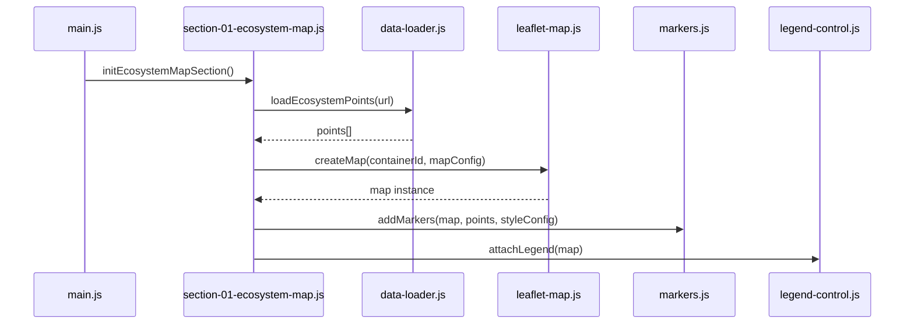

# Technical Architecture — CS617 Final Project Website

**Status:** Implementation planning only (no full site build).  
**Scope:** Section 01 — Greater Boston Academic Ecosystem Map + scaffolding for future scroll sections.  
**Hosting target:** GitHub Pages (static files, no build step required for v1).

**Related docs:** `SECTION_01_ECOSYSTEM_MAP_DESIGN.md`, `../data/DATASET_COLLECTION_PLAN.md`, `../PROJECT_MEMORY.md`

---

## 1. Design goals

| Goal | Approach |
|------|----------|
| GitHub Pages compatible | Static HTML/CSS/JS; CDN for Leaflet; no server |
| Scalable | One folder per concern; section modules added incrementally |
| Story-first | Single-page scroll; Section 01 is first `<section>` block |
| Maintainable | Canonical data in `/data/`; runtime copy under `website/data/` |
| Not overbuilt | No bundler required for v1; optional script copy later |

---

## 2. Recommended folder / file structure

```
Proposal/                          # repo root
├── data/                          # CANONICAL datasets (source of truth)
│   ├── greater_boston_academic_ecosystem_v1.csv
│   ├── DATASET_COLLECTION_PLAN.md
│   └── (future: enrollment.csv, neighborhood-ages.csv, …)
│
├── website/                       # DEPLOY ROOT for GitHub Pages
│   ├── index.html                 # single-page story shell (all sections eventually)
│   ├── ARCHITECTURE.md            # this file
│   ├── SECTION_01_ECOSYSTEM_MAP_DESIGN.md
│   │
│   ├── css/
│   │   ├── global.css             # reset, typography, layout, header/footer
│   │   ├── sections.css           # shared section spacing, scroll rhythm
│   │   ├── story-reveal.css       # global subtle scroll-in (fade + lift)
│   │   └── section-01-map.css   # #ecosystem-map only (map frame, legend, hero)
│   │
│   ├── js/
│   │   ├── main.js                # app entry: DOM ready, init sections in order
│   │   ├── config.js              # site-wide constants (paths, section IDs)
│   │   │
│   │   ├── story/
│   │   │   └── scroll-reveal.js   # IntersectionObserver for .story-reveal
│   │   │
│   │   ├── sections/
│   │   │   └── section-01-ecosystem-map.js   # Section 01 orchestrator
│   │   │
│   │   └── map/                   # Leaflet logic (section-01 only for now)
│   │       ├── map-config.js      # bounds, zoom, tile URL, category → style
│   │       ├── data-loader.js     # fetch + parse CSV → point records
│   │       ├── leaflet-map.js     # create map, tiles, attribution
│   │       ├── markers.js         # markers/tooltips from records
│   │       └── legend-control.js  # custom L.Control legend
│   │
│   ├── data/                      # PUBLISHED copies for fetch() at runtime
│   │   └── greater_boston_academic_ecosystem.csv
│   │
│   └── assets/                    # images (optional section-01: none required)
│       └── (future: icons, teaser images)
│
├── PROJECT_CONTEXT.md
├── PROJECT_MEMORY.md
└── …
```

### Files to create in implementation phase (not now)

| File | Responsibility |
|------|----------------|
| `index.html` | Document structure: header, `<section id="ecosystem-map">`, placeholders for later sections |
| `main.js` | Calls `initEcosystemMapSection()` when DOM ready |
| `section-01-ecosystem-map.js` | Wires loader → map → markers → legend for one container |
| `data-loader.js` | `fetch` CSV from `website/data/` |
| `leaflet-map.js` | Leaflet map instance bound to `#ecosystem-map-canvas` |
| `markers.js` | Point layer from parsed rows |
| `legend-control.js` | Bottom-left legend card per design spec |

### What stays outside `website/`

| Path | Role |
|------|------|
| `/data/*.csv` (repo root) | Editing, validation, IPEDS/OSM QA — **master** |
| `/proposal/`, `/slides/`, etc. | Not deployed |

---

## 3. Where datasets should live

### Two-layer model (recommended)

```
┌─────────────────────┐         copy when finalized          ┌──────────────────────┐
│  /data/  (canonical) │  ─────────────────────────────────►  │  /website/data/      │
│  *_v1.csv, raw/, …   │         manual or tiny script        │  runtime CSV for web │
└─────────────────────┘                                        └──────────────────────┘
```

| Layer | Path | Purpose |
|-------|------|---------|
| **Canonical** | `Proposal/data/` | Versioned source; planning docs; future `raw/` subfolder |
| **Published** | `Proposal/website/data/` | Only files the browser `fetch()`es — keeps paths simple on GH Pages |

**Why not fetch `../data/` from the site?**  
If GitHub Pages publishes **only** the `website/` folder, parent `data/` is not on the server. Publishing the whole repo from root is possible but mixes non-site files; **`website/data/` copy is the safest default.**

### v1 dataset file at runtime

- **Filename (published):** `website/data/greater_boston_academic_ecosystem.csv`  
- **Source:** copy from `data/greater_boston_academic_ecosystem_v1.csv` after QA (drop `_v1` suffix when stable).

### Future datasets (not Section 01)

| Future file | Canonical | Used by |
|-------------|-----------|---------|
| `enrollment_by_institution.csv` | `/data/` | Section 02 charts |
| `acs_age_by_tract.csv` | `/data/` | Optional choropleth v2 |

Keep chart CSVs in `/data/` only until a section is implemented; then copy or convert to `website/data/` as needed.

---

## 4. CSV vs GeoJSON for v1

| Format | Verdict for v1 |
|--------|----------------|
| **CSV** | **Primary source** — matches project stack, existing 87-row file, easy to edit in Excel/Sheets |
| **GeoJSON** | **Defer** — no polygon boundaries in v1; all features are points |

### Runtime pattern (v1)

1. `fetch('data/greater_boston_academic_ecosystem.csv')`  
2. Parse to array of objects: `{ id, name, category, city, lat, lon, … }`  
3. For each row where `include_on_map === 'true'`, create `L.circleMarker([lat, lon], options)` (or shape by category)

### Optional internal conversion (still v1, no file on disk)

```text
rows[]  →  GeoJSON FeatureCollection  →  L.geoJSON(layer, { pointToLayer })
```

Use **only if** it simplifies marker styling in one place. Not required for ~87 points.

### When to add GeoJSON files (v2+)

- Neighborhood zone **polygons** for housing areas  
- Massachusetts outline for highlight mask  
- Pre-built `points.geojson` if you add a build step — optional optimization, not needed now

**Decision:** **CSV in v1**; GeoJSON as a later enhancement for regions, not pins.

---

## 5. How the CSV should be loaded

### Mechanism

| Step | Detail |
|------|--------|
| API | `fetch()` (relative URL from `index.html`) |
| URL | `data/greater_boston_academic_ecosystem.csv` |
| Parsing | **Option A (v1 default):** small dependency **Papa Parse** via CDN — handles quoted `notes` fields safely |
| | **Option B:** hand-rolled parser only if CSV has no embedded commas in fields |
| Filter | Skip rows where `include_on_map` is `false` |
| Validate | Require `lat`, `lon`, `name`, `category`; log/skip bad rows in console |

### Loader module contract (`data-loader.js`)

```text
loadEcosystemPoints(csvUrl) → Promise<EcosystemPoint[]>

EcosystemPoint = {
  id, name, category, city, lat, lon,
  neighborhood?, notes?
}
```

### Error handling (lightweight)

- `fetch` fails → show short message in `#ecosystem-map-status` (empty map div), do not break rest of page  
- 0 rows → same message  
- No blocking alerts

### CORS / local dev

- Open site via **local static server** (`python -m http.server` in `website/`), not `file://`, so `fetch` works.  
- GitHub Pages serves over HTTPS — same-origin `data/` path works.

---

## 6. Leaflet.js organization

### Dependencies (CDN in `index.html` when implementing)

| Library | Use |
|---------|-----|
| Leaflet 1.9.x CSS + JS | Map core |
| OpenStreetMap tile URL | `https://{s}.tile.openstreetmap.org/{z}/{x}/{y}.png` |
| Papa Parse (optional) | CSV parse |

No npm/Webpack required for v1.

### Initialization flow



### Module responsibilities

| Module | Owns |
|--------|------|
| `map-config.js` | `MASSACHUSETTS_VIEW`, `GREATER_BOSTON_BOUNDS`, `CATEGORY_STYLES` (color, radius, shape class), tile attribution string |
| `leaflet-map.js` | `L.map()`, `L.tileLayer()`, `invalidateSize()` if needed, destroy/recreate guard |
| `markers.js` | Create marker layer group; bind `tooltip` / `bindPopup` minimal (name + category label); category → `L.circleMarker` options |
| `legend-control.js` | `L.Control.extend` — HTML legend card bottom-left per design |
| `section-01-ecosystem-map.js` | Select `#ecosystem-map-canvas`, call modules, no global `map` except optional `window.ecosystemMap` for debug |

### Map DOM hook (HTML plan)

```html
<section id="ecosystem-map" class="story-section">
  … hero, intro …
  <div class="map-shell">
    <div id="ecosystem-map-canvas" class="map-canvas" aria-label="Greater Boston academic ecosystem map"></div>
  </div>
  … insight …
</section>
```

Leaflet **must** initialize after the container has layout height (`section-01-map.css` min-height).

### Interactions (implementation mapping)

| Design spec | Leaflet implementation |
|-------------|-------------------------|
| Pan / zoom | Default + `scrollWheelZoom` (consider `false` until map focused) |
| Hover tooltip | `bindTooltip` permanent:false |
| Click | `bindPopup` same content or highlight marker |
| No side panel | No custom UI beyond tooltip |
| Legend | `L.control({ position: 'bottomleft' })` |

---

## 7. Scrolling storytelling website integration

### Page model: **single `index.html`**, vertical sections

```text
<body>
  <header class="site-header"> … project title, nav anchors … </header>

  <main class="story-main">
    <section id="ecosystem-map" class="story-section"> … Section 01 … </section>
    <!-- future -->
    <section id="enrollment-trends" class="story-section is-placeholder"> … </section>
    <section id="…" class="story-section is-placeholder"> … </section>
  </main>

  <footer class="site-footer"> … sources … </footer>

  <script src="js/config.js"></script>
  … map modules …
  <script src="js/sections/section-01-ecosystem-map.js"></script>
  <script src="js/main.js"></script>
</body>
```

### Section rhythm (all sections)

Each block should read as one continuous story, not a separate report chapter:

1. **Heading** (+ optional kicker)
2. **Short intro** (1–2 lines)
3. **Visualization** (map, chart) — appears quickly after intro
4. **Insights** — prose + supporting bullets below the viz

Use `.story-insight` (or section-specific BEM) for post-viz copy. Avoid cards, chapter labels, and heavy dividers.

### Scroll reveals (global, lightweight)

| Piece | Role |
|-------|------|
| `css/story-reveal.css` | Fade in + ~10px upward motion; ~0.72s ease |
| `js/story/scroll-reveal.js` | `initStoryScrollReveal()` — toggles reveal on each scroll-in/out |
| `.story-reveal` | On any element that should appear while scrolling |
| `.story-reveal--delay-1` … `--delay-3` | Stagger: heading → paragraph → detail list |

`main.js` calls `initStoryScrollReveal()` on `DOMContentLoaded`. Respects `prefers-reduced-motion: reduce`.

**Future sections:** add `story-reveal` to headings, insight paragraphs, chart captions, and bullet lists — same classes, no per-section animation framework.

### Scroll / UX (no heavy JS)

| Concern | v1 approach |
|---------|-------------|
| Section flow | Native document scroll; CSS `scroll-behavior: smooth` for nav anchor clicks only |
| Map height | CSS min-height on `.map-canvas` — map visible in one scroll from intro |
| Map init timing | **On `DOMContentLoaded`** — Section 01 is above the fold; map does not use scroll-reveal |
| Multiple maps later | Each section module owns its container ID; init when section enters viewport (future) |
| Sticky header | Measured in `main.js` as `--site-header-height`; section anchors scroll below header |

### Section registry pattern (`main.js`)

```text
const SECTION_INITS = [
  { id: 'ecosystem-map', init: initEcosystemMapSection },
  // { id: 'enrollment-trends', init: initEnrollmentSection },  // later
];

DOMContentLoaded → run each init (v1: only ecosystem map)
```

Keeps **one visualization at a time** per PROJECT_MEMORY workflow.

### CSS layering for scroll story

| File | Scope |
|------|-------|
| `global.css` | `html`, `body`, `.site-header`, `.story-main`, typography tokens |
| `sections.css` | `.story-section` padding, max-width utilities, `.prose` column, section dividers |
| `section-01-map.css` | `#ecosystem-map` hero, `.map-shell`, `.map-canvas`, legend overrides |

**No** CSS-in-JS. **No** framework.

---

## 8. Separation of concerns (summary)

| Layer | Location | Must not contain |
|-------|----------|------------------|
| **HTML** | `index.html` | Inline styles; minimal inline JS (ideally none) |
| **Global CSS** | `css/global.css`, `sections.css` | Map marker colors (those reference tokens also in `map-config.js`) |
| **Section CSS** | `css/section-01-map.css` | Leaflet API calls |
| **App entry** | `js/main.js` | Marker creation logic |
| **Section orchestrator** | `js/sections/section-01-ecosystem-map.js` | Tile URL strings (import from map-config) |
| **Map logic** | `js/map/*.js` | Hero copy, insight paragraph text |
| **Datasets** | `data/` + `website/data/` | JavaScript |

Copy (hero, intro, insight) lives in **HTML** for v1 — easy to edit for storytelling without redeploying logic.

---

## 9. GitHub Pages deployment

### Recommended settings

| Setting | Value |
|---------|-------|
| Source branch | `main` (or default) |
| Folder | **`/website`** (if available) **or** move `index.html` to `/docs` — **prefer publishing `website/`** as site root |
| Entry | `website/index.html` |

### Path rules

- All asset URLs **relative**: `css/global.css`, `js/main.js`, `data/greater_boston_academic_ecosystem.csv`  
- No absolute `/` paths unless repo is user/org root site  

### Attribution (in HTML or `leaflet-map.js`)

- © [OpenStreetMap](https://www.openstreetmap.org/copyright) contributors  
- Data: NCES IPEDS / curated academic ecosystem list (link to `data/SOURCES.md` when added)

---

## 10. Implementation order (when coding starts)

1. Create empty file tree + `index.html` shell with Section 01 markup only  
2. `global.css` + `section-01-map.css` (layout, map height)  
3. Copy CSV → `website/data/greater_boston_academic_ecosystem.csv`  
4. `data-loader.js` + test fetch in console  
5. `leaflet-map.js` + `map-config.js` — map renders tiles  
6. `markers.js` — pins from CSV  
7. `legend-control.js`  
8. `section-01-ecosystem-map.js` + `main.js`  
9. Local server test → GitHub Pages deploy  

**Do not** implement Sections 02+ until Section 01 is stable.

---

## 11. Explicitly out of scope (v1 architecture)

- React, Vue, Vite, npm lockfiles  
- Mapbox / Google Maps  
- Backend API, database, authentication  
- Marker clustering plugins (revisit if zoomed-out clutter appears)  
- GeoJSON zone layers  
- Plotly (reserved for chart sections)  
- Service workers / SPA routing  

---

## 12. Quick reference decisions

| Question | Decision |
|----------|----------|
| Deploy root? | `website/` |
| Canonical data? | `Proposal/data/` |
| Runtime data path? | `website/data/*.csv` |
| v1 format? | **CSV** |
| Leaflet split? | `js/map/*` + `js/sections/section-01-*.js` |
| Page structure? | Single scroll `index.html`, one `<section>` per story chapter |
| Init map when? | `DOMContentLoaded` (Section 01 above fold) |
