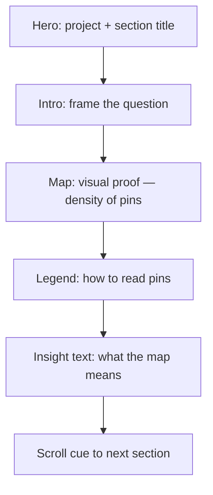

# Section 01 Design — Greater Boston Academic Ecosystem Map

**Status:** Layout & storytelling spec only (no HTML/CSS/JS).  
**Aligns with:** `PROJECT_MEMORY.md`, `data/DATASET_COLLECTION_PLAN.md`, `data/greater_boston_academic_ecosystem_v1.csv` (~87 pins).

---

## Section purpose

**Opening chapter** of the site. Before any charts or statistics, the reader *sees* that Greater Boston is saturated with academic infrastructure—not one campus, but an ecosystem.

**One-sentence takeaway:** *Student life is not confined to a single campus; it is woven across the metro.*

---

## Storytelling flow (read order)



| Step | User question answered | Emotional beat |
|------|------------------------|----------------|
| Hero | What is this site? What am I looking at? | Orientation |
| Intro | Why should I care? | Curiosity |
| Map | Where is the academic footprint? | Discovery / “wow, it’s everywhere” |
| Legend | What do the colors mean? | Comprehension |
| Insight | So what? | Meaning — ties to thesis |

**Do not** require interaction to understand the story. The map reinforces text; text frames the map.

---

## Page structure (vertical hierarchy)

Single full-width **section** (`#ecosystem-map`) — first content block after site header (or hero doubles as site opener).

```
┌─────────────────────────────────────────────────────────────┐
│  SITE HEADER (minimal, sticky later — out of scope for v1)   │
├─────────────────────────────────────────────────────────────┤
│  1. HERO / TITLE BLOCK          (~15–20% viewport height)    │
│     eyebrow + H1 + optional subline                          │
├─────────────────────────────────────────────────────────────┤
│  2. INTRO PARAGRAPH             (max-width text column)        │
│     2–3 sentences                                              │
├─────────────────────────────────────────────────────────────┤
│  3. MAP + LEGEND WRAPPER        (~55–65% viewport height)    │
│  ┌───────────────────────────────────────────────────────┐  │
│  │  ┌─────────────┐                                       │  │
│  │  │ Legend card │     LEAFLET MAP (centerpiece)         │  │
│  │  │ (compact)   │     drag + scroll zoom                 │  │
│  │  └─────────────┘                                       │  │
│  │  optional: subtle “Zoom to Greater Boston” control      │  │
│  └───────────────────────────────────────────────────────┘  │
│  OSM attribution line (small, below map frame)                 │
├─────────────────────────────────────────────────────────────┤
│  4. STORYTELLING INSIGHT        (max-width text column)        │
│     1 short paragraph + optional 2–3 bullet highlights       │
├─────────────────────────────────────────────────────────────┤
│  5. SECTION FOOTER              (scroll hint / divider)        │
└─────────────────────────────────────────────────────────────┘
```

**Content width:** Text blocks use a **narrow column** (~640–720px) centered. Map uses **wider column** (~90–95% of page max-width, cap ~1100–1200px) so geography reads clearly.

**Vertical rhythm:** Generous whitespace between blocks; no side-by-side text+map on desktop (map stays full-width below intro—cleaner, reference-site style).

---

## 1. Hero / title area

### Content

| Element | Copy direction (draft) |
|---------|----------------------|
| **Eyebrow** (small caps) | `Section 01` or `The Ecosystem` |
| **H1** | `Greater Boston Academic Ecosystem` |
| **Subline** (optional, one line) | `Boston: A Hub of Academic Excellence` — ties to project title |

### Visual tone

- Light background: off-white `#FAFAFA` or white.
- H1: serif or strong sans (academic, not startup)—e.g. Georgia / Source Serif / system serif for title only.
- Eyebrow: muted gray, letter-spaced.
- **No** background video, parallax, or animated hero text.

### Hierarchy

- H1 is the **largest type on the page** (site opener).
- Hero is **short**—user reaches the map within one scroll on laptop.

---

## 2. Intro paragraph

### Role

Bridge from title to map. State the **narrative premise** in plain language.

### Draft copy (editable)

> Boston is often described as a college town—but that label hides how large the academic footprint really is. Universities, community colleges, student neighborhoods, research institutes, and teaching hospitals cluster across Boston, Cambridge, and nearby cities. Explore the map below to see how deeply student life and academic institutions shape Greater Boston.

### Specs

- **Length:** 2–3 sentences (~45–70 words).
- **Tone:** Journalistic, clear, present tense.
- **Placement:** Centered, directly under hero, above map.
- **No** bullet lists here—save bullets for insight block.

---

## 3. Map centerpiece (interaction & UX)

### Initial view

| Setting | Value | Rationale |
|---------|-------|-----------|
| **Viewport** | Show **most of Massachusetts** | PROJECT_MEMORY: wide context |
| **Pin cluster** | Greater Boston bbox | Pins concentrated; empty west = contrast |
| **Default center** | ~42.36°N, -71.08°W | Between Boston & Cambridge |
| **Default zoom** | ~9–10 | State visible; GB cluster readable |
| **Basemap** | OpenStreetMap light standard | Bright/light mode |

### Map frame

- Rounded corners (8–12px), light border or soft shadow—card-like, not edge-to-edge brutalist.
- Fixed **min-height:** ~480px desktop / ~360px mobile.
- **Aspect ratio:** ~16:10 or flexible height with min-height (prefer height over tiny map).

### Interactions (lightweight only)

| Action | Behavior |
|--------|----------|
| **Pan / drag** | Standard Leaflet |
| **Scroll zoom** | Enabled; optional `scrollWheelZoom: false` until map clicked (reduces scroll hijack) |
| **Hover pin** | Small tooltip: **name** + category label (e.g. “University”) |
| **Click pin** | Same tooltip or slight emphasis (scale/stroke)—**no** side panel, no modal |
| **Click map background** | Clear selection |

**Optional (v1.1, not required):** one button “Focus on Greater Boston” — animates bounds to metro (~42.23–42.40, -71.20–-70.95).

### Clutter control

- **No** cluster spiderfy explosion at default zoom—if clustering used, loose clusters only at state zoom.
- **No** heatmap layer in v1.
- **No** filter UI in v1 (legend is read-only); filters are a later section enhancement.
- Pin count ~87: individual markers acceptable at metro zoom.

### Accessibility (planning)

- Tooltip readable on keyboard focus (future).
- Category not conveyed by color alone—shape differs per DATASET plan (circle / diamond / square).

---

## 4. Legend (small, subordinate to map)

### Placement

**Preferred:** Compact **card overlaid** on map — **bottom-left** inside map frame (Leaflet control style).

- Does not compete with hero text.
- Stays visible while panning (position: absolute within map container).

**Alternative (if overlay feels busy):** Thin horizontal legend **directly above** map, right-aligned—still “small.”

### Content (5 categories — academic only)

| Swatch | Label |
|--------|-------|
| Blue circle | University |
| Light blue circle | College |
| Orange ring | Student housing zone |
| Green diamond | Research institute |
| Red-orange square | Medical / research center |

### Specs

- **Title:** `Legend` or `What you're seeing` (small, bold).
- **No** long descriptions per category—label only.
- **Size:** ~180–220px wide card; 12–13px labels.
- Background: white 92% opacity + subtle shadow (readable on map tiles).

### Category filter (explicitly out of v1)

Do not add toggle buttons yet—keeps section clean. Reader explores visually first.

---

## 5. Storytelling insight (below map)

### Role

Interpret what the user just saw. Move from **observation → meaning**.

### Structure

1. **Lead sentence** (bold or slightly larger): thesis restatement.
2. **Supporting paragraph** (2–3 sentences): patterns to notice on the map.
3. **Optional highlight line** (3 short bullets max)—only if they add clarity.

### Draft copy (editable)

**Lead:**  
**Academic Boston is not one campus—it is a network.**

**Body:**  
Notice how pins cluster along the Charles River, in Longwood, and around Kendall Square and Fenway. Student housing zones (orange) sit beside universities (blue) and medical campuses (red), showing that “student city” means neighborhoods—not just classrooms. Research institutes (green) and teaching hospitals often sit next to university pins, linking education to science and health across the metro.

**Optional bullets:**

- **Longwood** — medical schools, hospitals, and student housing in one corridor  
- **Fenway / Kenmore** — multiple universities and dense student rental zones  
- **Cambridge** — Harvard, MIT, and affiliated research within miles  

### Specs

- Max-width matches intro paragraph.
- **No** second map, no chart embed here—pure text bridge to Section 02.
- End with subtle **scroll affordance:** “Continue ↓” or section divider line.

---

## Visual system (section-level)

| Token | Direction |
|-------|-----------|
| Background | White / `#FAFAFA` |
| Text | `#1a1a1a` body, `#555` secondary |
| Accent | Pull from legend blue `#2166AC` for links/eyebrow |
| Map frame | `#e8e8e8` border |
| Typography | One sans for body; optional serif for H1 only |
| Spacing scale | 8px base: 24 / 32 / 48 / 64 between blocks |

**Reference feel:** [Unemployment in MA vs U.S.](https://avanith12.github.io/Unemployment-in-Massachusetts-vs.-the-U.S/) — sequential scroll, one viz per section, short prose, light theme.

**Avoid:** dark mode v1, glassmorphism, sticky map hijacking full viewport, sound, scroll-triggered animations.

---

## Responsive behavior (layout only)

| Breakpoint | Changes |
|------------|---------|
| **Desktop (≥1024px)** | Layout as wireframe above |
| **Tablet (768–1023px)** | Map 85% width; legend overlay shrinks |
| **Mobile (<768px)** | H1 smaller; map min-height ~320px; legend **below map** as horizontal chip row OR collapsible “Legend ▾” above map—avoid covering tiles on small screens |

**Touch:** tap = tooltip; two-finger pinch zoom on map.

---

## Section boundaries & navigation

- **Section ID:** `#ecosystem-map` (anchor for nav).
- **First section** — may include minimal site title in hero OR rely on global header (decide when building shell).
- **Next section preview:** Insight text last line can tease: “Next: how enrollment has changed over time…” (align with future chart section—placeholder OK).

---

## What this section deliberately omits

- Enrollment statistics, charts, time sliders  
- Corporate biotech pins or filters  
- Full-screen map takeover, cinematic fly-through  
- Heavy info panels, Wikipedia cards, search box  
- Audio, video, Lottie  

---

## Implementation checklist (when coding starts)

- [ ] HTML section skeleton matching 5 blocks above  
- [ ] Load `greater_boston_academic_ecosystem_v1.csv` (or final CSV)  
- [ ] Leaflet + OSM tiles + category markers  
- [ ] Legend control component  
- [ ] Tooltip: name + category  
- [ ] OSM + data attribution footer  

**Until then:** treat this document as the layout source of truth for Section 01.
