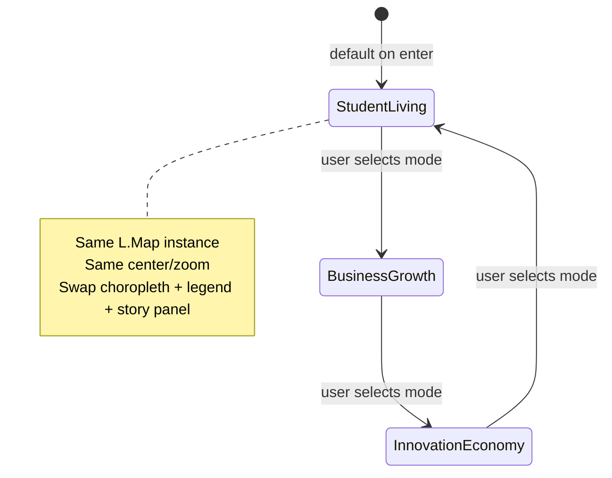

# Section 04 — Neighborhood Impact Heatmap (Implementation Plan)

**Status:** Implemented on site (HTML/CSS/JS). Data from `data/section_04/`.  
**Website section number:** **04** (fourth story section after hero).  
**Placement:** After Section 03 (ecosystem-scale enrollment). This *is* the neighborhood heatmap section.  
**Does not modify:** Hero, Section 01 ecosystem map, Section 02 enrollment chart, or global navigation styling.

**Related data:** `data/section_04/processed/` (dataset folder name matches website §04)  
**Related site patterns:** `SECTION_01_ECOSYSTEM_MAP_DESIGN.md`, `ARCHITECTURE.md`, `css/story-reveal.css`, `js/story/scroll-reveal.js`

---

## 1. Section purpose

**Story question:** Where does academic and student life show up *in the city itself* — not on campuses, but in neighborhoods?

**One-sentence takeaway:** *Student and academic influence is geographic: housing pressure, social business clusters, and innovation/workforce signals concentrate in different parts of Boston.*

**What this section is NOT:**
- A second university pin map
- Three separate full-page maps
- Enterprise GIS (layer tree, coordinate tools, dense control panels, giant legends)

**What it IS:**
- One persistent Boston neighborhood map
- Three editorial “modes” that swap heat intensity + narrative
- An **evolving visual story** — cinematic, reflective, human, urban (same tone as hero / §01 / §02)

---

## 2. Section identity (DOM / nav)

| Item | Recommendation |
|------|----------------|
| **HTML `id`** | `neighborhood-impact` |
| **CSS scope class** | `story-section--neighborhood` |
| **Nav label** | “Neighborhoods” or “City impact” |
| **Eyebrow** | “Beyond the campus” |
| **H2 (draft)** | “How Academic Life Shapes Boston’s Neighborhoods” |
| **Footer link from §03** | `story-section__continue` → `#neighborhood-impact` |

**Section order on page (corrected):**

```
landing-hero
→ ecosystem-map          (§01 — academic ecosystem map)
→ enrollment-trends      (§02 — enrollment chart)
→ ecosystem-scale        (§03 — ecosystem enrollment hero)
→ neighborhood-impact    (§04 — this heatmap section)
```

**Optional within §03 intro:** A short “250,000+ students” stat line or transition beat can live **inside** block 1 (intro area), not as a separate website section.

---

## 3. Layout architecture (exact visual flow)

Single `<section id="neighborhood-impact" class="story-section story-section--neighborhood">`.

Read order is **fixed top → bottom**. Map sits **above** mode selectors (centerpiece first, controls second — story-first, not dashboard-first).

```
┌─────────────────────────────────────────────────────────────┐
│  BLOCK 1 — SECTION INTRO AREA                                │
│  · large immersive heading                                   │
│  · short storytelling paragraph                              │
│  · subtle editorial atmosphere (light gradient / doodle)   │
│  · human, urban, story-driven — NOT technical                │
├─────────────────────────────────────────────────────────────┤
│  BLOCK 2 — MAIN HEATMAP CONTAINER (visual centerpiece)       │
│  · ONE wide immersive Leaflet choropleth                     │
│  · min-height ~60–70vh desktop; responsive                   │
│  · cinematic spacing; NOT boxed-in or dashboard-small        │
│  · minimal legend (bottom-left); attribution under frame     │
├─────────────────────────────────────────────────────────────┤
│  BLOCK 3 — MODE SELECTOR ROW (below map)                     │
│  [ Student Living ]  [ Business Growth ]  [ Innovation Economy ]│
│  · horizontal row, evenly spaced editorial cards             │
│  · subtle hover; responsive stack/scroll on mobile           │
├─────────────────────────────────────────────────────────────┤
│  BLOCK 4 — DYNAMIC STORY PANEL                               │
│  · updates when mode changes; soft text transition           │
│  · what the current heatmap represents + contextual insight  │
├─────────────────────────────────────────────────────────────┤
│  BLOCK 5 — FINAL INSIGHT / TAKEAWAY                          │
│  · reflective closing; ties back to Boston / student city    │
│  · cinematic, immersive — not a data appendix                │
├─────────────────────────────────────────────────────────────┤
│  (optional) SECTION FOOTER — scroll cue                      │
└─────────────────────────────────────────────────────────────┘
```

### Block 1 — Section intro area

| Goal | Detail |
|------|--------|
| **Introduce** | How student and academic life spread into Boston neighborhoods |
| **Tone** | Human, urban, story-driven |
| **Typography** | Large H2 (`clamp(1.75rem, 4vw, 2.75rem)`), generous line-height |
| **Atmosphere** | Very subtle background wash or light editorial doodle (low opacity); no heavy boxes |
| **Copy direction** | Frame the city beyond campuses; set up the map as proof, not as “tool” |

**Scroll reveal:** `data-story-reveal-group` on intro wrapper.

### Block 2 — Main heatmap container

| Requirement | Detail |
|-------------|--------|
| **Layout** | Full content width (`max-width: var(--max-width-wide)`), breaks out of narrow text column |
| **Size** | `min-height: clamp(360px, 65vh, 720px)` on `#neighborhood-heatmap-canvas` |
| **Feel** | Cinematic spacing above/below; soft border radius + light shadow (reuse `map-shell` pattern from §01) |
| **Transitions** | Choropleth fill crossfades on mode change; map instance **never** reloads |
| **Avoid** | Small embedded map, dense GIS chrome, layer toggles in corner cluster |

Legend: **compact** — gradient strip + metric label only; no multi-column dashboard legend.

### Block 3 — Mode selector row

| Requirement | Detail |
|-------------|--------|
| **Layout** | `display: grid; grid-template-columns: repeat(3, 1fr); gap: 1rem` (desktop) |
| **Labels** | Student Living · Business Growth · Innovation Economy |
| **Style** | Editorial cards — border, soft fill, active accent (site primary `#1f4e79` + accent `#d97706`) |
| **Interaction** | Hover lift `translateY(-2px)`; active ring; **not** pill tabs or Bootstrap nav |
| **Mobile** | `grid-template-columns: 1fr` or horizontal scroll-snap with snap points |
| **A11y** | `role="tablist"` / `role="tab"`; `aria-selected` on active card |

**Spacing above row:** `margin-top: 2rem` from map attribution — clear separation, still one story unit.

### Block 4 — Dynamic story panel

| Requirement | Detail |
|-------------|--------|
| **Content** | Mode title + 2–3 sentences + optional 1–2 bullets |
| **Behavior** | `aria-live="polite"`; crossfade `opacity` 200–300ms on mode switch |
| **Width** | Narrow column (`max-width: 42rem`) centered under mode row |
| **Avoid** | Long methodology walls; keep insight readable in one screen glance |

Three HTML panels (one per mode) with `.is-active` toggle — preferred over JS string injection for SEO.

### Block 5 — Final insight / takeaway

| Requirement | Detail |
|-------------|--------|
| **Purpose** | Connect visualization → overall thesis: Boston shaped by student/academic ecosystems |
| **Tone** | Cinematic, reflective |
| **Layout** | Slightly larger lead line + short paragraph; optional top border or subtle divider |
| **Static** | Does not change with mode (contrast to block 4) |

### Spacing + flow (section-wide)

| Use | Avoid |
|-----|--------|
| Generous vertical rhythm (`4.5–6rem` section padding) | Cramped stacks |
| Immersive flow intro → map → choose lens → read story → reflect | Dashboard density |
| Smooth transitions (map fill, text fade) | Excessive controls |
| Clean hierarchy (5 clear blocks) | Giant legends, layer trees |

**Width rhythm:** Blocks 1, 4, 5 inside `story-flow__content` (narrow). Block 2 map uses wide shell. Block 3 mode row can match map width for alignment.

---

## 4. Interaction model (core architecture)

### One map, three modes



| Principle | Implementation |
|-----------|----------------|
| Map persists | Create `L.map` once in `initNeighborhoodHeatmapSection()` |
| No reload | Never destroy/recreate map on mode change |
| Viewport locked | Do not call `fitBounds` on mode switch after first paint |
| Layer transition | `setStyle()` on one `L.geoJSON` layer; optional 300–450ms opacity crossfade |
| State | `currentMode: 'living' \| 'business' \| 'innovation'` |

**Mode change sequence:** map colors update → legend updates → block 4 text crossfades. Map pan/zoom unchanged.

---

## 5. Data architecture

### Published runtime files (`website/data/`)

Copy from canonical `data/section_04/processed/`:

| Published file | Source |
|----------------|--------|
| `boston_neighborhood_boundaries.geojson` | `raw/geography/boston_neighborhood_boundaries.geojson` |
| `layer_a_housing_pressure.csv` | `processed/layer_a_housing_pressure_v1.csv` |
| `layer_b_business_density.csv` | `processed/layer_b_business_density_v1.csv` |
| `layer_c_innovation_workforce.csv` | `processed/layer_c_innovation_workforce_v1.csv` |

### Default metric per mode (v1)

| Mode | Primary `metric_key` |
|------|----------------------|
| **Student Living** | `population_age_20_24_share` (labeled: proxy, not enrollment) |
| **Business Growth** | `osm_restaurant_count` |
| **Innovation Economy** | `employment_management_professional_share` |

Join: GeoJSON `neighborhood_id` → `geo_id` = `bos_nbhd_{XX}`.

---

## 6. Visual design — heatmap modes

| Mode | Fill ramp (low → high) | Mood |
|------|------------------------|------|
| Student Living | `#e8f4fc` → `#7ec8e3` → `#1f6b8a` | Soft blue / teal |
| Business Growth | `#fef3e2` → `#f0b87a` → `#c45c26` | Muted amber warmth |
| Innovation Economy | `#e6f5f0` → `#5bb5a0` → `#0d5c4a` | Deeper teal |

Avoid: red emergency palettes, rainbow ramps, neon GIS defaults.

---

## 7. Narrative content (per mode)

### Mode 1 — Student Living

**Lead:** “Neighborhoods surrounding academic corridors became some of the city’s most student-centered areas.”

**Body:** Young-adult concentration and housing pressure show up unevenly — Fenway, Allston, and Mission Hill read differently than West Roxbury or Hyde Park. This view uses census age 20–24 shares as a neighborhood signal, not campus enrollment counts.

### Mode 2 — Business Growth

**Lead:** “Restaurants, cafes, and coworking spaces concentrated around high student activity zones.”

**Body:** OpenStreetMap counts show where day-to-day social infrastructure clusters — downtown and Back Bay densest for restaurants; campus-adjacent neighborhoods mix cafes and quick-service spots.

### Mode 3 — Innovation Economy

**Lead:** “Academic ecosystems became closely connected with research, startups, and innovation industries.”

**Body:** Education attainment and professional employment shares highlight corridors where knowledge work stacks — Longwood, downtown, and parts of Brighton/South Boston Waterfront show different workforce mixes.

### Block 5 — Final takeaway (static)

**Lead:** “Boston’s academic map does not end at campus gates.”

**Body:** Student living, street-level business growth, and workforce/innovation proxies tell three sides of one geographic story — the same city, read through different neighborhood lenses. Boston is shaped not only by where students study, but by where they live, spend time, and connect to the wider economy.

---

## 8. Technical architecture (files & modules)

```
website/
├── index.html                              # add §03 block only
├── css/
│   └── section-04-neighborhood.css           # blocks 1–5 layout + map + mode cards
├── js/
│   ├── config.js                           # + neighborhoodImpact section id/paths
│   ├── sections/
│   │   └── section-04-neighborhood-heatmap.js
│   └── heatmap/
│       ├── heatmap-config.js
│       ├── layer-data-loader.js
│       ├── geojson-loader.js
│       ├── choropleth-layer.js
│       ├── mode-controller.js
│       └── legend-control.js
└── data/
    ├── boston_neighborhood_boundaries.geojson
    ├── layer_a_housing_pressure.csv
    ├── layer_b_business_density.csv
    └── layer_c_innovation_workforce.csv
```

| §01 module | §03 module |
|------------|------------|
| `js/map/*` (pins) | `js/heatmap/*` (choropleth) — separate; do not edit §01 files |

### `config.js` (planned)

```javascript
sections: {
  ecosystemMap: "ecosystem-map",
  enrollmentTrends: "enrollment-trends",
  neighborhoodImpact: "neighborhood-impact",  // §04
},
```

### `main.js` (planned)

```javascript
{ id: "neighborhood-impact", init: initNeighborhoodHeatmapSection }
```

Lazy-init via `IntersectionObserver` when §03 enters viewport — recommended.

---

## 9. Scope boundaries

### v1 must-have

- [ ] Five-block layout exactly as §3 (intro → map → modes → story panel → takeaway)
- [ ] One choropleth, three modes, persistent viewport
- [ ] Soft transitions on map + narrative
- [ ] Editorial mode cards below map
- [ ] No changes to §01, §02, hero, nav

### v1 out of scope

- Separate “Section 04” on the website (there is none — this doc replaces that typo)
- Cambridge/Somerville polygons
- Changes to existing sections’ CSS/JS

---

## 10. Implementation phases

| Phase | Task |
|-------|------|
| **A** | Publish `website/data/` copies from `data/section_04/` |
| **B** | HTML five-block skeleton + `section-04-neighborhood.css` |
| **C** | Heatmap JS (loaders, choropleth, modes, legend) |
| **D** | Narrative panel + transitions + QA |

---

## 11. QA checklist

- [ ] Visual order: intro → **large map** → mode row → story panel → takeaway
- [ ] Section is **§03** in nav and story order (after enrollment)
- [ ] Map feels immersive (wide, tall), not dashboard-small
- [ ] Mode row below map; cards editorial, not enterprise tabs
- [ ] Story panel soft-transitions on mode change
- [ ] No §01/§02 regressions

---

## 12. Handoff (corrected numbering)

```text
Build WEBSITE Section 04 (#neighborhood-impact) — neighborhood heatmap storytelling.
Layout: (1) intro (2) large heatmap (3) three mode cards BELOW map (4) dynamic story panel (5) final takeaway.
One Leaflet choropleth; three modes swap fill + legend + narrative only.
Data: data/section_04 → website/data/ (geojson + layer_a/b/c CSVs).
Files: section-04-neighborhood.css, section-04-neighborhood-heatmap.js, js/heatmap/*.
Do NOT label as Section 04. Do NOT edit §01 map or §02 chart.
```

---

*Corrected: website Section 04 = heatmap section. Dataset folder `data/section_04/` aligns with this section.*
